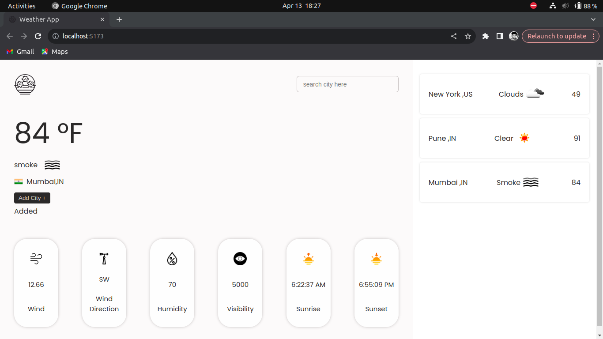

# Weather App

Welcome to our Weather App! This app helps you stay informed about the weather conditions in your area and around the world. With a user-friendly interface and real-time data updates, you can plan your day with confidence.

## Features

- **Current Weather:** View the current temperature, conditions, humidity, wind speed, and direction.

- **Location-Based Weather:** Search for weather in other cities.
- **City List:** Add city in list for later view

## Technologies Used

- **React:** A JavaScript library for building user interfaces.
- **TypeScript:** A statically typed superset of JavaScript that enhances code quality and developer productivity.
- **Redux Toolkit:** A package that simplifies Redux development by providing utilities for common tasks like store setup, reducer creation, and action dispatching.
- **Weather API:** Utilize a weather API to fetch real-time weather data.

## Getting Started

1. **Clone the repository:**

   git clone https://github.com/Akshaykalhane/weather-app-react-typescript-redux

2. **Install dependencies:**
   npm install
   note:first install node in your system

3. **Run the app:**
   npm run dev
  

4. **Open your browser and navigate to [http://localhost:5173/](http://localhost:5173/) to view the app.**

